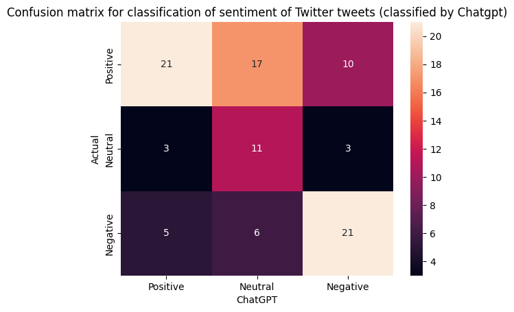
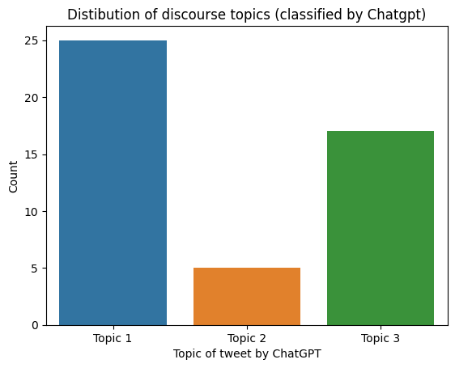

# **GPTalyze** - API for short text snippet analysis with ChatGPT-4

This repository contains an example to an interaction with ChatGPT to analyze Twitter posts (based on the ```gpt-3.5-turbo``` language model).
The example Jupyter notebook analyzes the publicly available Twitter dataset containing tweets about the COVID-19 pandemic (More information on the dataset's page at [Kaggle](https://www.kaggle.com/datasets/datatattle/covid-19-nlp-text-classification/)).

## Installation
- Install ```Python```  (Python 3.8) with Jupyter (or Jupyter-lab interface).
- Create a virtual environment (or alternatively Anaconda environment) and install the following packages (using ```pip install <package_name>```): ```numpy```, ```pandas```, ```seaborn```, ```jupyter```, ```nltk```, ```tweepy```, ```spacy```, ```gensim```, ```pysentimiento```, ```twarc```, ```openai```, ```sklearn```.

## Description and usage
[ChatGPT](https://chat.openai.com/) has recently emerged as a powerful Large Language Model (LLM), enabling unprecedented and innovative public interaction with generative language AI.
> "As of April 2023, ChatGPT boasts about 173 million active users and 1.8 billion monthly website visits" (reported by [Nerdynav](https://nerdynav.com/chatgpt-statistics/)).

These capabilities were not overlooked by the research community, who started leveraging ChatGPT for data analysis of various data sources, including textual unstructured data from social networks, such as Twitter.
In this "GPTalyze" repository, we utilize ChatGPT's API for analysis of textual data, employing ChatGPT's zero-shot-like abilities to summarize the discussed topics in a textual corpus and perform other Natural Language Processing (NLP) tasks, such as sentiment analysis and emotion detection.
Specifically, we evaluate the interaction with ChatGPT on a publicly available Twitter dataset containing tweets about the COVID-19 pandemic. More information is available on the dataset's page at [Kaggle](https://www.kaggle.com/datasets/datatattle/covid-19-nlp-text-classification/) (filename is "Corona_NLP_train.csv").
Since ChatGPT is a generic tool, (almost) any textual data from other sources can also be used for evaluation.

Thanks to the chat interaction of ChatGPT, the usage of this repository is quite simple.
- First, we download the textual corpus and pre-process it to be more natural for human interaction. This includes extracting the tweet's posted text, removing unnecessary URLs, removing special characters that may not be recognized by the chat etc (jupyter notebook ```prepare_twitter_data.ipynb```).
- Once the dataset is clean, we can call ChatGPT's API with the desired task and ask it to perform it (jupyter notebook ```interact_with_chatgpt_general.ipynb```).
> [!NOTE]
> API call limits may apply, depending on the pricing plan registered on your OpenAI account.
  
### Setting up ChatGPT's API calls

  The call to ChagGPT's API can be established as follows.
  * The client instance is initialized using the API key that can be obtained from ChatGPT API portal (after signing up to the service).
  ```
  from openai import OpenAI
  client = OpenAI(api_key=<api_key>)
  ```
  * The `prompt` variable stores the user input that contains some questions or requests to ChatGPT. It can have several inputs, which are concatenated to a single prompt. For example, here we ask ChatGPT to classify a given text to either a negative, neutral or positive sentiment.
  ```
  sentiments_dict = {1: "Positive", 2: "Neutral", 3: "Negative"}
  prompt = [{"role": "user",
               "content": "Is the sentiment of this tweet positive, neutral, or negative? Answer only with a number: 1 if {}, 2 if {}, and 3 if {}. Here is the text:".format(
                   sentiments_dict[1],
                   sentiments_dict[2],
                   sentiments_dict[3])
              },
              {"role": "user", "content": text}]
   ```
  * The prompt input is sent to the Chat using the `client.chat.completions.create(...)` interface. We used the ChatGPT's `gpt-3.5-turbo` language model, as GPT-4 has not been widely released to the public yet. The `temperature` variable controls the potential randomness in ChatGPT's answers. Here, we set it to medium (`temperature=0.5`), balancing creativity, consistency, and the accuracy of its response. A lower temperature would give less creative responses and more expected answers, which could increase the chat's accuracy.
  ``` 
    # Generate a response
    chat_completion = client.chat.completions.create(
        messages=prompt,
        model="gpt-3.5-turbo",
        temperature=0.5,
        max_tokens=1024
    )
  ```
  * Finally, to retrieve ChatGPT's answers, we access the prompt's `message.content` attribute.
  ```
    response = chat_completion.choices[0].message.content
  ```
  ### Usage Example

  Here, we demonstrate two very useful use cases: *sentiment analysis* and *extraction of discourse topics*.
  1. **Sentiment analysis**: We asked ChatGPT to classify each tweet in a sample of 100 tweets discussing COVID-19 to either negative, neutral or positive sentiment. Since out dataset contained a manually annotated label for each tweet, we could evaluate ChatGPT's performance. Using the following confusion matrix, we can deduce that ChatGPT was only moderate in its accuracy, classifying only ~60% of the tweets correctly.
  > [!NOTE]
  > The `temperature` value of the chat's model can be further fined-tuned. Setting a lower temperature can increase the accuracy of the results.

  

  2. **Topic extraction**: We also asked ChatGPT to extract the three main topics (and their sub-topics) discussed in a batch of 50 random tweets about COVID-19. This task would have been challenging to a human, but is performed in seconds by ChatGPT with impressive results (we eyeballed the tweets manually to evaluate the received topics and they corresponded to the returned topics).
   ```
    The 3 main topics discussed in the tweets regarding COVID-19 are:
    1. COVID-19 Outbreak and Panic Buying:
    - Panic buying and stock shortages due to COVID-19
    - Encouraging people to not panic and only buy what they need
    - Retail store closures and restrictions due to the outbreak
    
    2. Online Shopping and Payment Methods:
    - Using online shopping and payment methods to prevent the spread of the virus
    - Increased demand for online orders and potential delays
    - Impact of COVID-19 on consumer shopping behavior
    
    3. Community Support and Assistance:
    - Helping neighbors and vulnerable individuals during the outbreak
    - Donating to food banks and nonprofits to support those impacted by COVID-19
    - Providing free deliveries of essential goods to elderly individuals in need.
   ```
   Then, we asked the chat to classify each tweet in a different batch of tweets to one of the three main topics. Here, we plot the distribution of assigned topics to a different sample of 50 tweets.
     
   

